# MindWall — Complete Technical Documentation
**Version:** 1.0.0  
**Author:** Pradyumn Tandon ([pradyumntandon.com](https://pradyumntandon.com)) at VRIP7 ([vrip7.com](https://vrip7.com) / [github.com/vrip7](https://github.com/vrip7))  
**Classification:** Production Engineering Reference  
**Project:** MindWall — Cognitive Firewall / AI-Powered Human Manipulation Detection  

---

## Table of Contents

1. [System Overview](#1-system-overview)
2. [High-Level Architecture](#2-high-level-architecture)
3. [Service Topology](#3-service-topology)
4. [Authentication & Authorization](#4-authentication--authorization)
5. [Analysis Pipeline](#5-analysis-pipeline)
6. [12 Manipulation Dimensions](#6-12-manipulation-dimensions)
7. [Rule-Based Pre-Filter](#7-rule-based-pre-filter)
8. [Behavioral Baseline Engine](#8-behavioral-baseline-engine)
9. [Score Aggregation](#9-score-aggregation)
10. [IMAP/SMTP Proxy](#10-imapsmtp-proxy)
11. [Email Account Management](#11-email-account-management)
12. [Database Schema](#12-database-schema)
13. [Dashboard UI](#13-dashboard-ui)
14. [Browser Extension](#14-browser-extension)
15. [Fine-Tuning Pipeline](#15-fine-tuning-pipeline)
16. [API Reference](#16-api-reference)
17. [Docker Deployment](#17-docker-deployment)
18. [Security Model](#18-security-model)
19. [Repository Structure](#19-repository-structure)
20. [Environment Configuration](#20-environment-configuration)

---

## 1. System Overview

MindWall is a fully self-hosted, privacy-first cybersecurity platform that intercepts, analyzes, and scores incoming and outgoing email communications for psychological manipulation tactics. It uses a locally-run Qwen3-8B large language model via Ollama — **zero data leaves the deployment boundary**. All inference runs on-premises.

The system deploys as four Docker containers: an Ollama GPU inference server, a FastAPI analysis engine, a transparent IMAP/SMTP proxy, and a React admin dashboard — all orchestrated via Docker Compose.

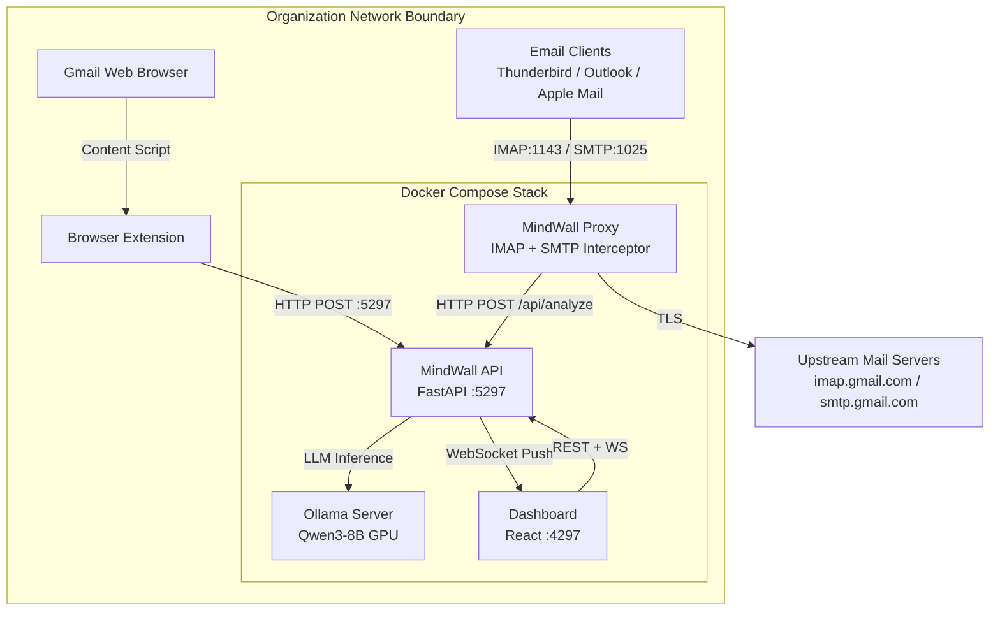

**Key Design Principles:**
- **Zero Trust Data Policy**: No email content, analysis results, or employee data leaves the host machine
- **Transparent Interception**: Email clients require only an IMAP/SMTP server address change — no plugins or agents
- **12-Dimension Scoring**: Every email is scored across 12 distinct psychological manipulation dimensions
- **Real-Time Alerting**: WebSocket-driven dashboard receives alerts within seconds of email arrival
- **Behavioral Baselines**: Per-sender communication pattern baselines detect deviation from normal behavior

---

## 2. High-Level Architecture

The system follows a pipeline architecture where each email passes through multiple analysis stages before a final risk score is computed and alerts are dispatched.

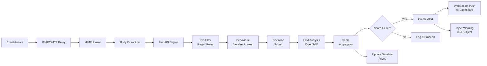

**Processing Time Breakdown:**
| Stage | Typical Latency | GPU Required |
|---|---|---|
| Pre-Filter (regex) | < 5ms | No |
| Baseline Lookup | < 10ms | No |
| Deviation Scoring | < 5ms | No |
| LLM Inference | 2–8 seconds | Yes (24GB VRAM) |
| Score Aggregation | < 1ms | No |
| DB Persistence | < 15ms | No |
| WebSocket Broadcast | < 1ms | No |

---

## 3. Service Topology

MindWall deploys as four Docker services interconnected via two Docker networks.

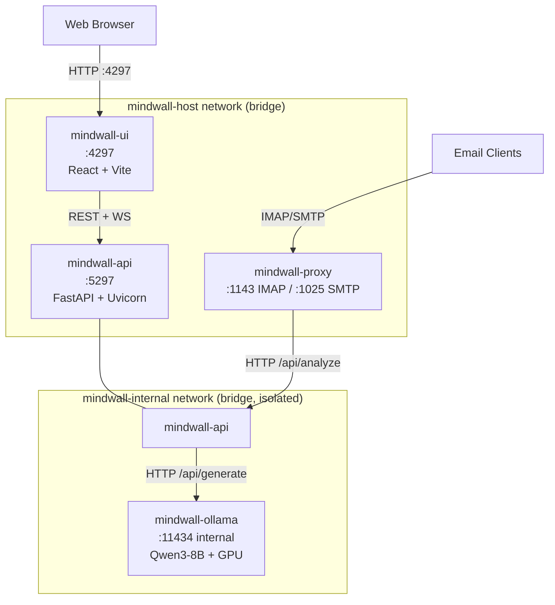

| Service | Container | Port | Image | Purpose |
|---|---|---|---|---|
| Ollama | `mindwall-ollama` | 11434 (internal) | `ollama/ollama:latest` | GPU LLM inference server |
| API | `mindwall-api` | 5297 | `python:3.12-slim` | Analysis engine + REST API |
| Proxy | `mindwall-proxy` | 1143, 1025 | `python:3.12-slim` | Transparent IMAP/SMTP interceptor |
| Dashboard | `mindwall-ui` | 4297 | `node:20-alpine` | React admin interface |

---

## 4. Authentication & Authorization

MindWall uses a two-layer authentication model: a dashboard login flow and an internal API key for service-to-service communication.

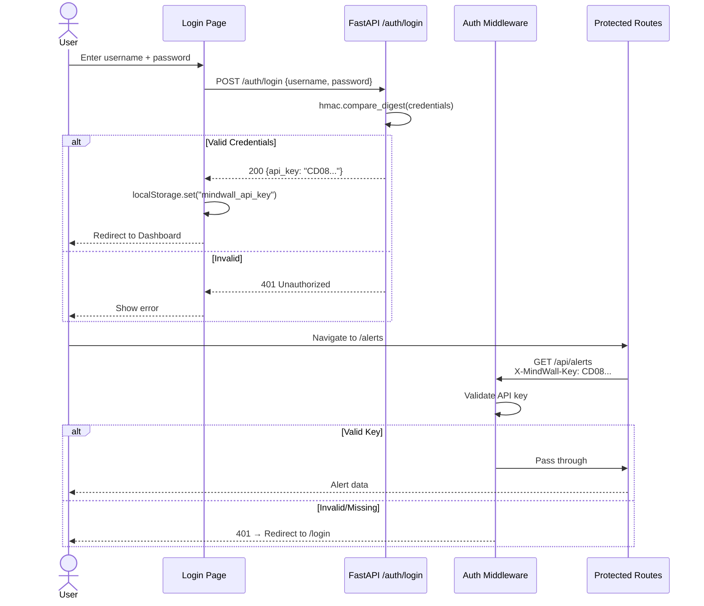

**Authentication Details:**
- **Dashboard Login**: `POST /auth/login` validates `username` + `password` against environment variables (`DASHBOARD_USERNAME`, `DASHBOARD_PASSWORD`) using `hmac.compare_digest` to prevent timing attacks
- **API Key**: Returned on successful login; stored in `localStorage` as `mindwall_api_key`
- **Request Interceptor**: Axios automatically attaches `X-MindWall-Key` header to every API request
- **401 Auto-Redirect**: The Axios response interceptor clears the stored key and redirects to `/login` on any 401/403 response
- **Public Paths**: `/auth/login`, `/health`, `/docs`, `/openapi.json`, `/favicon.ico` are excluded from auth

**Default Credentials (configurable via .env):**
```
DASHBOARD_USERNAME=admin
DASHBOARD_PASSWORD=MindWall@2026
```

---

## 5. Analysis Pipeline

The core analysis pipeline processes each email through 10 sequential stages. The pipeline is orchestrated by `api/analysis/pipeline.py`.

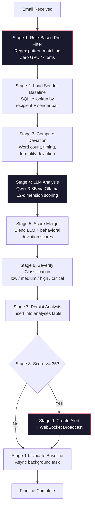

**Severity Classification Thresholds (configurable at runtime):**

| Score Range | Severity | Recommended Action | Default Threshold |
|---|---|---|---|
| 0–34 | `low` | Proceed | — |
| 35–59 | `medium` | Proceed with caution | 35.0 |
| 60–79 | `high` | Verify before acting | 60.0 |
| 80–100 | `critical` | Block / escalate | 80.0 |

---

## 6. 12 Manipulation Dimensions

Every email is scored across 12 independent psychological manipulation dimensions. Each dimension has a defined weight used in the final aggregate score calculation.

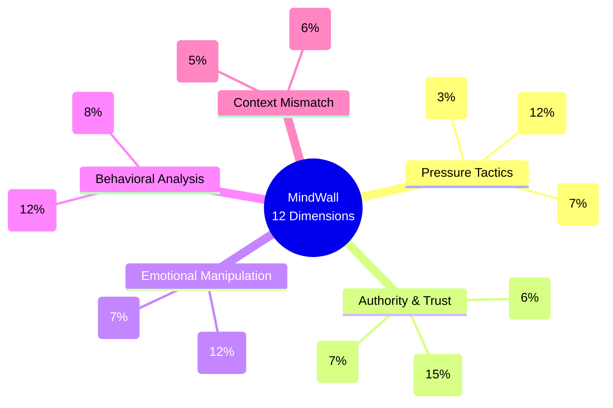

| # | Dimension | Weight | Description |
|---|---|---|---|
| 1 | `artificial_urgency` | 12% | Manufactured time pressure or false deadlines |
| 2 | `authority_impersonation` | 15% | Falsely claiming or implying authority (CEO, legal, government) |
| 3 | `fear_threat_induction` | 12% | Using threats, consequences, or fear to coerce action |
| 4 | `reciprocity_exploitation` | 7% | Leveraging past favors or fabricated obligations |
| 5 | `scarcity_tactics` | 7% | Creating false scarcity of time, resource, or opportunity |
| 6 | `social_proof_manipulation` | 6% | Fabricating consensus or peer behavior to influence |
| 7 | `sender_behavioral_deviation` | 12% | Deviation from this sender's established communication baseline |
| 8 | `cross_channel_coordination` | 8% | Evidence of coordinated multi-channel attack |
| 9 | `emotional_escalation` | 7% | Escalating emotional intensity to override rational thinking |
| 10 | `request_context_mismatch` | 6% | Request inconsistent with stated context or relationship |
| 11 | `unusual_action_requested` | 5% | Requesting atypical actions (wire transfer, credentials, gift cards) |
| 12 | `timing_anomaly` | 3% | Suspicious timing relative to sender's typical patterns |

**Total Weight: 100%** — All dimensions sum to 1.0.

---

## 7. Rule-Based Pre-Filter

The pre-filter runs before LLM inference with zero GPU usage and sub-5ms latency. It applies regex and keyword pattern matching to identify common social engineering signals.

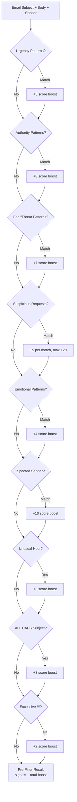

**Pattern Categories:**
- **Urgency**: `immediately`, `urgent`, `asap`, `act now`, `expires today`, `last chance`
- **Authority**: `CEO`, `CFO`, `on behalf of`, `compliance requirement`, `law enforcement`, `IRS`, `FBI`
- **Fear/Threat**: `account suspended`, `legal action`, `prosecution`, `security breach`
- **Suspicious Requests**: `wire transfer`, `gift card`, `click here`, `verify your account`, `keep this secret`
- **Emotional**: `please help`, `desperate`, `counting on you`, `only you can`
- **Spoofed Sender**: Domain patterns like `paypal.com-verify.xyz`

The maximum pre-filter score boost is configurable (default: 15.0) and is added to the LLM aggregate score.

---

## 8. Behavioral Baseline Engine

MindWall builds per-sender behavioral baselines for each recipient. These baselines track historical communication patterns and flag deviations.

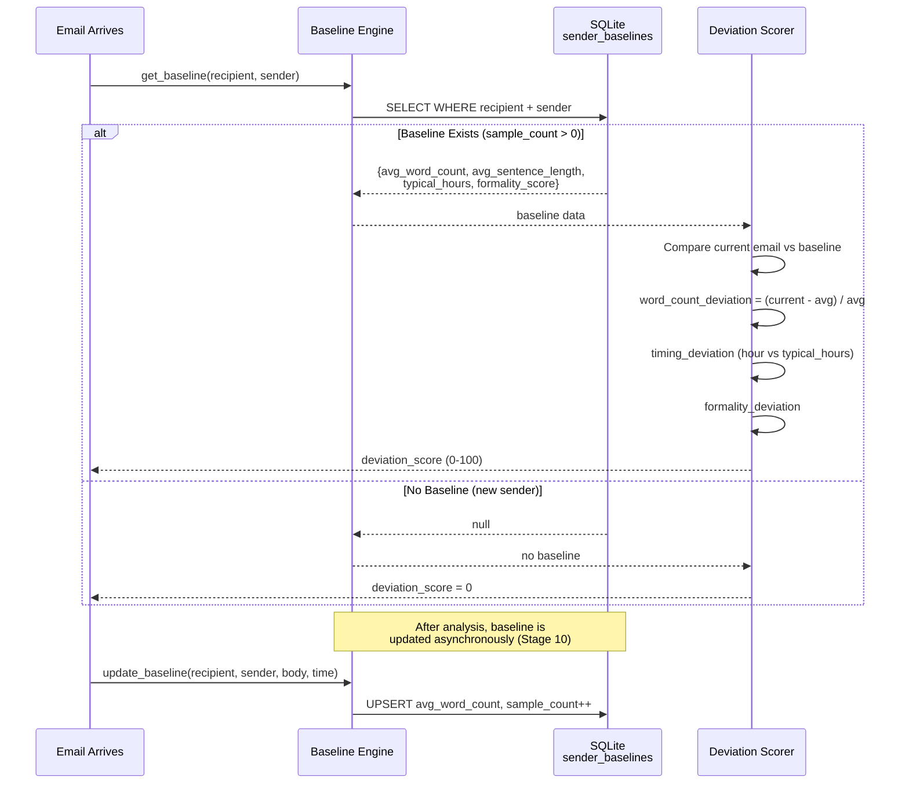

**Baseline Fields:**
| Field | Type | Description |
|---|---|---|
| `avg_word_count` | REAL | Rolling average email word count from this sender |
| `avg_sentence_length` | REAL | Average sentence length in words |
| `typical_hours` | JSON | Array of typical UTC send hours `[9,10,11,14,15]` |
| `formality_score` | REAL | 0.0 (casual) to 1.0 (formal) communication style |
| `typical_requests` | JSON | Common request types historically observed |
| `sample_count` | INTEGER | Number of emails used to build baseline |

**Deviation Score Blending:**
The final `sender_behavioral_deviation` dimension score is a weighted blend:
- 60% behavioral deviation engine score
- 40% LLM assessment of behavioral deviation

---

## 9. Score Aggregation

The Score Aggregator merges LLM dimension scores with behavioral deviation data and computes a single weighted aggregate manipulation score.

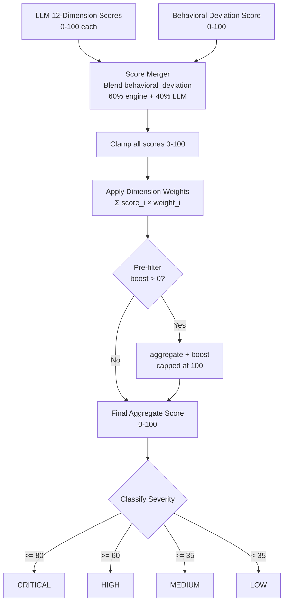

**Formula:**
```
aggregate = Σ (dimension_score[i] × dimension_weight[i]) + prefilter_boost
final_score = clamp(aggregate, 0, 100)
```

**Configurable Weights (runtime via Settings page):**
| Parameter | Default | Range | Description |
|---|---|---|---|
| `behavioral_weight` | 0.6 | 0.0–1.0 | Weight of behavioral engine in deviation blend |
| `llm_weight` | 0.4 | 0.0–1.0 | Weight of LLM in deviation blend |
| `prefilter_score_boost` | 15.0 | 0–50 | Max pre-filter boost added to aggregate |

---

## 10. IMAP/SMTP Proxy

The MindWall proxy is a transparent IMAP/SMTP interceptor that sits between email clients and upstream mail servers. It intercepts FETCH responses, extracts email bodies, sends them for analysis, and injects risk scores back into the email subject.

```mermaid
sequenceDiagram
    participant Client as Email Client<br/>(Thunderbird / Outlook)
    participant Proxy as MindWall Proxy<br/>:1143 / :1025
    participant Upstream as Upstream IMAP<br/>imap.gmail.com:993
    participant API as MindWall API<br/>:5297

    Client->>Proxy: IMAP LOGIN user pass
    Proxy->>Upstream: LOGIN user pass (TLS)
    Upstream-->>Proxy: OK LOGIN
    Proxy-->>Client: OK LOGIN

    Client->>Proxy: FETCH 1:* (RFC822)
    Proxy->>Upstream: FETCH 1:* (RFC822)
    Upstream-->>Proxy: * 1 FETCH (RFC822 {body})
    
    rect rgb(25, 25, 50)
        Proxy->>Proxy: MIME Parse → Extract text/plain
        Proxy->>API: POST /api/analyze<br/>{body, sender, recipient, uid}
        API-->>Proxy: {manipulation_score: 72,<br/>severity: "high"}
        Proxy->>Proxy: Inject "[⚠ MindWall: HIGH 72]"<br/>into Subject header
    end
    
    Proxy-->>Client: Modified FETCH response<br/>with risk score in subject
```

**Proxy Features:**
- **Transparent**: No client modification required — just change IMAP/SMTP server to `localhost:1143` / `localhost:1025`
- **TLS Termination**: Accepts plain connections from local clients, upgrades to TLS for upstream
- **IMAP FETCH Interception**: Parses IMAP protocol, intercepts `FETCH` responses containing `RFC822` or `BODY[]`
- **MIME Parsing**: Extracts `text/plain` and `text/html` (HTML stripped and sanitized) from multi-part MIME
- **Score Injection**: Prepends `[⚠ MindWall: SEVERITY SCORE]` to the email Subject header
- **SMTP Monitoring**: Outbound emails pass through for logging (no modification by default)

---

## 11. Email Account Management

Users configure their upstream email server connections through the dashboard Settings page. These configurations tell the proxy which IMAP/SMTP servers to connect to for each email account.

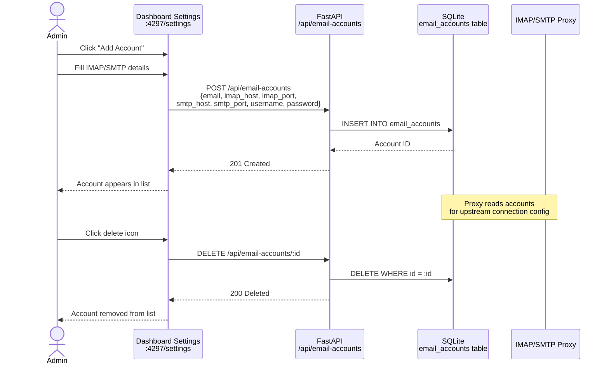

**Email Account Fields:**
| Field | Type | Default | Description |
|---|---|---|---|
| `email` | TEXT | required | Email address (unique identifier) |
| `display_name` | TEXT | null | Human-readable name |
| `imap_host` | TEXT | required | IMAP server hostname (e.g. `imap.gmail.com`) |
| `imap_port` | INTEGER | 993 | IMAP port (993 for TLS, 143 for STARTTLS) |
| `smtp_host` | TEXT | required | SMTP server hostname (e.g. `smtp.gmail.com`) |
| `smtp_port` | INTEGER | 587 | SMTP port (587 for STARTTLS, 465 for TLS) |
| `username` | TEXT | required | Login username (usually the email address) |
| `password` | TEXT | required | App password or account password |
| `use_tls` | BOOLEAN | true | Whether to use TLS for upstream connections |
| `enabled` | BOOLEAN | true | Whether this account is actively proxied |

**Common Provider Configurations:**
| Provider | IMAP Host | IMAP Port | SMTP Host | SMTP Port |
|---|---|---|---|---|
| Gmail | `imap.gmail.com` | 993 | `smtp.gmail.com` | 587 |
| Outlook/365 | `outlook.office365.com` | 993 | `smtp.office365.com` | 587 |
| Yahoo | `imap.mail.yahoo.com` | 993 | `smtp.mail.yahoo.com` | 587 |
| Zoho | `imap.zoho.com` | 993 | `smtp.zoho.com` | 587 |

> **Gmail Users**: You must generate an **App Password** (Google Account → Security → 2-Step Verification → App passwords). Regular passwords will not work with Gmail's IMAP/SMTP.

---

## 12. Database Schema

MindWall uses SQLite via aiosqlite for zero-dependency persistent storage. The schema contains 5 tables.

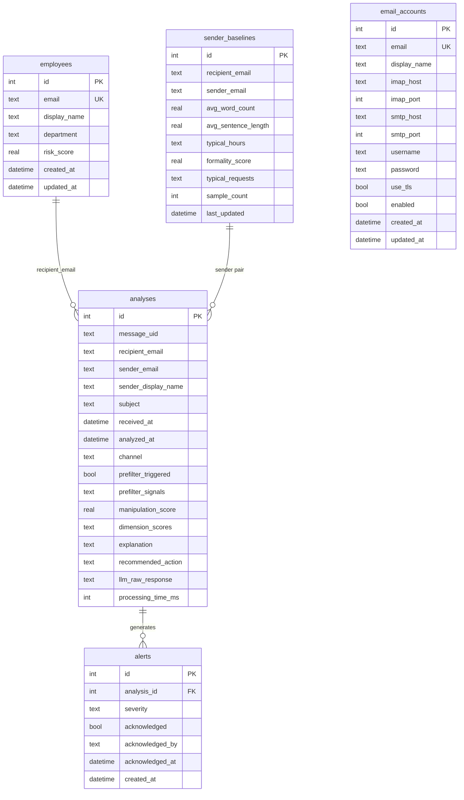

**Indexes for Performance:**
```sql
CREATE INDEX idx_analyses_recipient ON analyses(recipient_email, analyzed_at DESC);
CREATE INDEX idx_analyses_score     ON analyses(manipulation_score DESC);
CREATE INDEX idx_alerts_severity    ON alerts(severity, acknowledged, created_at DESC);
CREATE INDEX idx_baselines_lookup   ON sender_baselines(recipient_email, sender_email);
```

---

## 13. Dashboard UI

The React dashboard provides real-time monitoring, alert management, employee risk tracking, and system configuration.

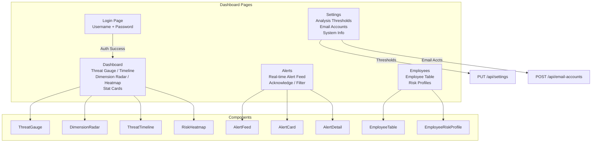

**Dashboard Stat Cards (5 metrics):**
| Card | Icon | Data Source |
|---|---|---|
| Emails Analyzed | Mail | `summary.total_analyses` |
| Active Alerts | AlertTriangle | `summary.unacknowledged_alerts` (sum) |
| Monitored Employees | Users | `summary.employee_count` |
| Email Accounts | Inbox | `emailAccounts.length` |
| Avg Threat Score | Shield | `summary.average_score` |

**Settings Page Sections:**

1. **Analysis Thresholds** — Runtime-configurable sliders:
   - Critical Alert Threshold (default: 80)
   - High Alert Threshold (default: 60)
   - Medium Alert Threshold (default: 35)
   - Pre-filter Score Boost (default: 15)
   - Behavioral Deviation Weight (default: 0.6)
   - LLM Analysis Weight (default: 0.4)

2. **Email Accounts** — CRUD interface for IMAP/SMTP proxy configurations:
   - Add Account form (email, display name, IMAP/SMTP host+port, username, password, TLS toggle)
   - Account list with active/disabled status badges
   - Delete account button

3. **System Info** — Read-only display of API version, LLM model, database type, developer info

---

## 14. Browser Extension

The MindWall browser extension intercepts emails rendered in Gmail's web interface and sends them to the API for analysis.

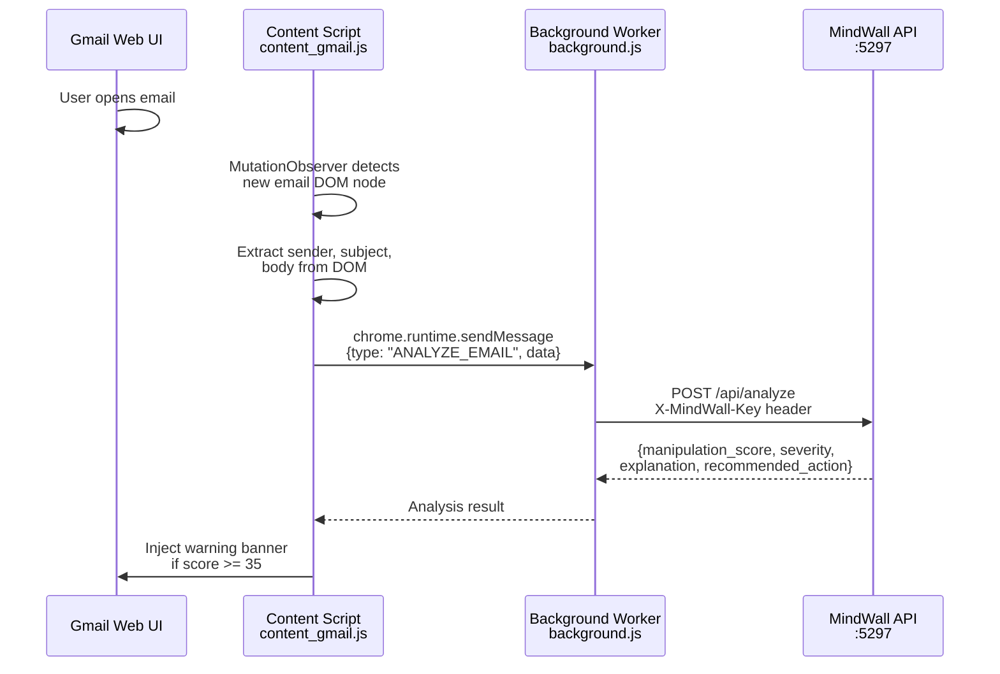

**Extension Configuration (manifest.json):**
- **Manifest Version**: 3
- **Permissions**: `activeTab`, `storage`
- **Host Permissions**: `http://localhost:5297/*`
- **Content Scripts**: Injected on `*://mail.google.com/*`
- **Service Worker**: `background.js`

---

## 15. Fine-Tuning Pipeline

MindWall includes a complete QLoRA fine-tuning pipeline using Unsloth for training a manipulation-detection specialist model on an 8GB GPU.

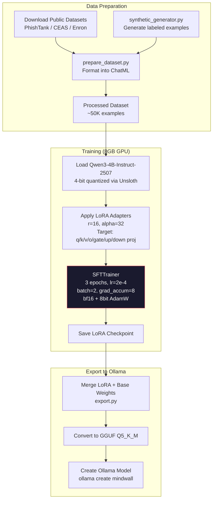

**Training Configuration:**
| Parameter | Value |
|---|---|
| Base Model | `unsloth/Qwen3-4B-Instruct-2507` |
| Quantization | 4-bit (QLoRA) — fits 8GB VRAM |
| LoRA Rank | 16 |
| LoRA Alpha | 32 |
| LoRA Dropout | 0.05 |
| Learning Rate | 2e-4 |
| Scheduler | Cosine annealing |
| Epochs | 3 |
| Effective Batch Size | 16 (2 × 8 gradient accumulation) |
| Max Sequence Length | 2048 tokens |
| Precision | bf16 |
| Optimizer | AdamW 8-bit |
| VRAM Usage | ~6–7GB peak |

**Training Data Sources (public domain / permissive license):**
| Dataset | Source | Size | Content |
|---|---|---|---|
| PhishTank | phishtank.com | ~1.5M | Known phishing URLs + content |
| CEAS 2008 | Spam corpus | ~30K | Phishing emails labeled |
| Enron Phishing | CMU CERT | ~1.7K | Annotated phishing in enterprise context |
| CSIRO Social Engineering | research.csiro.au | ~500 | Social engineering transcripts |
| Synthetic | `synthetic_generator.py` | ~20K | Model-generated labeled examples |

---

## 16. API Reference

All endpoints require the `X-MindWall-Key` header unless listed as public.

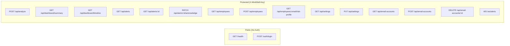

### Authentication

| Endpoint | Method | Auth | Description |
|---|---|---|---|
| `/auth/login` | POST | Public | Validate credentials, return API key |
| `/health` | GET | Public | Service health check |

### Analysis

| Endpoint | Method | Description |
|---|---|---|
| `/api/analyze` | POST | Submit email for full pipeline analysis |

**Request:**
```json
{
  "message_uid": "IMAP-12345",
  "recipient_email": "employee@company.com",
  "sender_email": "ceo@company-verify.com",
  "sender_display_name": "CEO John Smith",
  "subject": "URGENT: Wire Transfer Required Immediately",
  "body": "I need you to process a wire transfer of $45,000...",
  "channel": "imap",
  "received_at": "2026-03-18T08:30:00Z"
}
```

**Response:**
```json
{
  "analysis_id": 42,
  "manipulation_score": 87.3,
  "severity": "critical",
  "explanation": "This email impersonates executive authority and creates artificial urgency to request an unusual wire transfer.",
  "recommended_action": "block",
  "dimension_scores": {
    "artificial_urgency": 92,
    "authority_impersonation": 88,
    "fear_threat_induction": 45,
    "unusual_action_requested": 95,
    "...": "..."
  },
  "processing_time_ms": 3421
}
```

### Dashboard

| Endpoint | Method | Description |
|---|---|---|
| `/api/dashboard/summary` | GET | Aggregate stats: total analyses, alert counts, avg score, heatmap |
| `/api/dashboard/timeline` | GET | Time-series threat data (query: `start_date`, `end_date`) |

### Alerts

| Endpoint | Method | Description |
|---|---|---|
| `/api/alerts` | GET | List alerts (query: `severity`, `acknowledged`, `limit`, `offset`) |
| `/api/alerts/:id` | GET | Full alert detail with analysis breakdown |
| `/api/alerts/:id/acknowledge` | PATCH | Mark alert as acknowledged |

### Employees

| Endpoint | Method | Description |
|---|---|---|
| `/api/employees` | GET | List monitored employees |
| `/api/employees` | POST | Register new employee for monitoring |
| `/api/employees/:email/risk-profile` | GET | Employee risk profile with analysis history |

### Settings

| Endpoint | Method | Description |
|---|---|---|
| `/api/settings` | GET | Current system settings |
| `/api/settings` | PUT | Update thresholds and weights (runtime) |

### Email Accounts

| Endpoint | Method | Description |
|---|---|---|
| `/api/email-accounts` | GET | List configured email accounts (passwords redacted) |
| `/api/email-accounts` | POST | Create or update email account (upsert by email) |
| `/api/email-accounts/:id` | DELETE | Remove email account configuration |

### WebSocket

| Endpoint | Protocol | Description |
|---|---|---|
| `/ws/alerts` | WebSocket | Real-time alert push (JSON frames) |

---

## 17. Docker Deployment

### Quick Start

**Linux / macOS:**
```bash
git clone https://github.com/vrip7/MindWall.git
cd MindWall
chmod +x setup.sh && ./setup.sh
```

**Windows:**
```powershell
git clone https://github.com/vrip7/MindWall.git
cd MindWall
.\setup.ps1
```

**Manual:**
```bash
cp .env.example .env          # Edit with your API_SECRET_KEY
docker compose up -d --build
# Wait for Ollama health check (~60s), then:
docker exec mindwall-ollama ollama pull qwen3:8b
```

### Service Health Verification

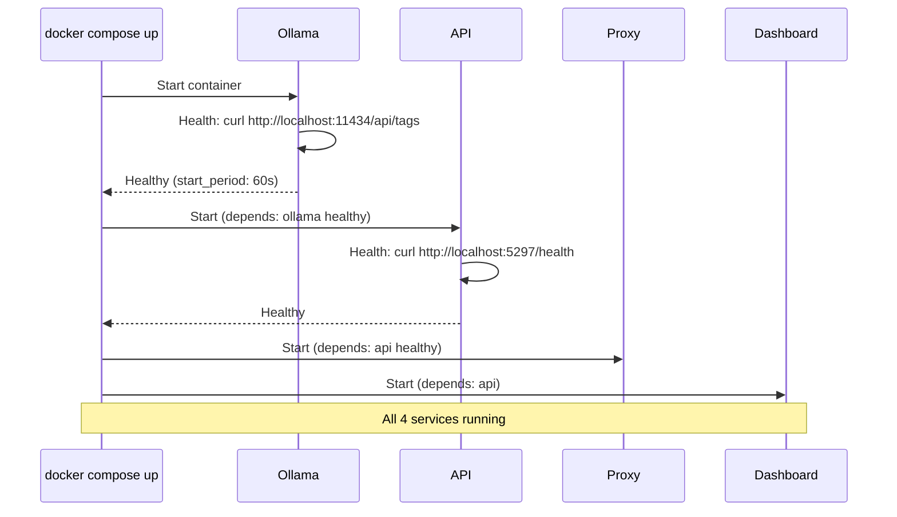

### Port Mapping

| Service | Container Port | Host Port | Protocol |
|---|---|---|---|
| Dashboard | 4297 | 4297 | HTTP |
| API | 5297 | 5297 | HTTP |
| Ollama | 11434 | — (internal) | HTTP |
| IMAP Proxy | 1143 | 1143 | IMAP |
| SMTP Proxy | 1025 | 1025 | SMTP |

### Docker Networks

| Network | Type | Services | Purpose |
|---|---|---|---|
| `mindwall-internal` | bridge (isolated) | ollama, api | GPU inference — no internet access |
| `mindwall-host` | bridge | api, proxy, dashboard | Host-facing services |

---

## 18. Security Model

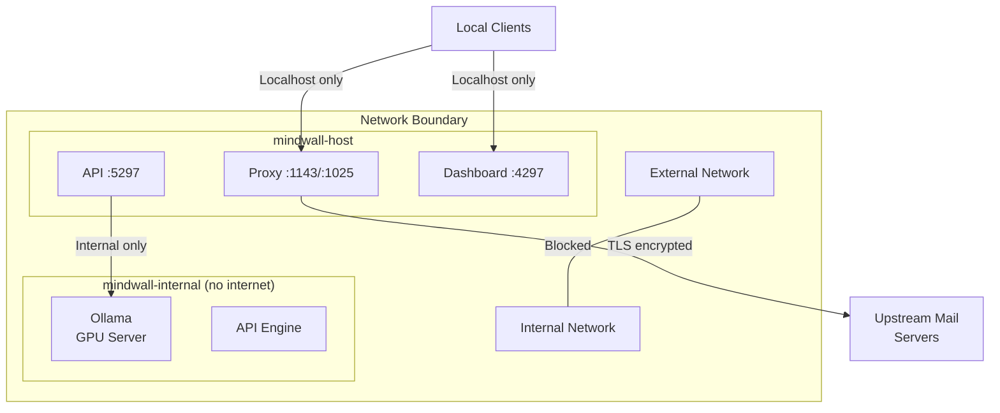

**Security Layers:**

1. **Network Isolation**: Ollama runs on an internal-only Docker network with no internet access. Only the API container can reach it.

2. **Authentication**: All API endpoints require `X-MindWall-Key` header. Dashboard login uses `hmac.compare_digest` for timing-attack-safe credential comparison.

3. **TLS Upstream**: Proxy connections to upstream IMAP/SMTP servers use TLS encryption.

4. **No Data Exfiltration**: All email content, analysis results, and LLM inference stay within the Docker network boundary. Zero external API calls.

5. **Request ID Tracing**: Every request receives a unique `X-Request-ID` header for audit trail logging.

6. **Input Validation**: All API inputs validated via Pydantic models with strict type enforcement and bounds checking.

7. **Password Storage**: Email account passwords stored in SQLite — in production, use disk encryption and restrict filesystem access to the Docker volume.

8. **CORS**: Restricted to `http://localhost:4297` (dashboard) and browser extension origins only.

---

## 19. Repository Structure

```
mindwall/
├── docker-compose.yml                    # 4-service orchestration
├── docker-compose.override.yml           # Dev overrides (hot reload, volume mounts)
├── .env                                  # Environment variables (secret key, credentials)
├── setup.sh / setup.ps1                  # One-command bootstrap scripts
├── Makefile                              # dev/prod task runner
├── Docs.md                              # This document
├── README.md                            # Project overview
│
├── api/                                  # FastAPI Core Engine
│   ├── main.py                           # App factory + router registration
│   ├── core/
│   │   ├── config.py                     # Pydantic Settings (env vars)
│   │   ├── lifespan.py                   # Startup/shutdown lifecycle
│   │   └── logging.py                    # Structured JSON logging (structlog)
│   ├── routers/
│   │   ├── analyze.py                    # POST /api/analyze
│   │   ├── auth.py                       # POST /auth/login
│   │   ├── dashboard.py                  # GET /api/dashboard/*
│   │   ├── alerts.py                     # GET/PATCH /api/alerts/*
│   │   ├── employees.py                  # GET/POST /api/employees/*
│   │   ├── settings.py                   # GET/PUT /api/settings
│   │   ├── email_accounts.py             # GET/POST/DELETE /api/email-accounts
│   │   └── websocket.py                  # WS /ws/alerts
│   ├── analysis/
│   │   ├── pipeline.py                   # 10-stage analysis orchestrator
│   │   ├── prefilter.py                  # Regex pre-filter (zero GPU)
│   │   ├── llm_client.py                 # Ollama HTTP client (async httpx)
│   │   ├── prompt_builder.py             # Structured prompt construction
│   │   ├── scorer.py                     # 12-dimension score aggregator
│   │   ├── dimensions.py                 # Dimension definitions + weights
│   │   └── behavioral/
│   │       ├── baseline.py               # Per-sender baseline engine
│   │       ├── deviation.py              # Deviation scoring
│   │       └── cross_channel.py          # Multi-channel coordination
│   ├── db/
│   │   ├── database.py                   # Async SQLAlchemy engine + DDL
│   │   ├── models.py                     # ORM models (5 tables)
│   │   ├── repositories/                 # Data access layer
│   │   └── migrations/
│   │       └── init_schema.sql           # Schema DDL
│   ├── schemas/                          # Pydantic request/response models
│   ├── middleware/
│   │   ├── auth.py                       # API key validation middleware
│   │   └── request_id.py                 # Request tracing
│   └── websocket/
│       ├── manager.py                    # WS connection manager
│       └── events.py                     # Event type definitions
│
├── proxy/                                # IMAP/SMTP Proxy Service
│   ├── main.py                           # Starts IMAP + SMTP servers
│   ├── config.py                         # Proxy configuration
│   ├── imap/
│   │   ├── server.py                     # Async IMAP server (:1143)
│   │   ├── upstream.py                   # TLS connection to upstream IMAP
│   │   ├── parser.py                     # RFC 3501 IMAP parser
│   │   ├── interceptor.py                # FETCH response interceptor
│   │   └── injector.py                   # Risk score subject injection
│   ├── smtp/
│   │   ├── server.py                     # Async SMTP server (:1025)
│   │   └── upstream.py                   # Forward to upstream SMTP
│   ├── mime/
│   │   ├── parser.py                     # MIME email body extractor
│   │   └── sanitizer.py                  # HTML stripping + normalization
│   └── ssl/
│       └── handler.py                    # TLS termination/upgrade
│
├── dashboard/                            # React + Tailwind Admin UI
│   ├── src/
│   │   ├── App.jsx                       # Auth gating + routing
│   │   ├── api/
│   │   │   ├── client.js                 # Axios HTTP client + interceptors
│   │   │   └── websocket.js              # WebSocket client manager
│   │   ├── components/
│   │   │   ├── layout/                   # Sidebar, TopBar, Layout
│   │   │   ├── dashboard/               # ThreatGauge, Radar, Timeline, Heatmap
│   │   │   ├── alerts/                  # AlertCard, AlertFeed, AlertDetail
│   │   │   └── employees/              # EmployeeTable, RiskProfile
│   │   └── pages/
│   │       ├── Login.jsx                 # Authentication page
│   │       ├── Dashboard.jsx             # Main overview (5 stat cards + charts)
│   │       ├── Alerts.jsx                # Alert management
│   │       ├── Employees.jsx             # Employee monitoring
│   │       └── Settings.jsx              # Thresholds + Email Accounts + System Info
│
├── extension/                            # Browser Extension (Gmail)
│   ├── manifest.json                     # WebExtension Manifest V3
│   ├── background.js                     # Service worker
│   └── content_gmail.js                  # Gmail DOM observer + extractor
│
└── finetune/                             # QLoRA Fine-Tuning Pipeline
    ├── train.py                          # Unsloth training script
    ├── prepare_dataset.py                # Data formatting
    ├── evaluate.py                       # Evaluation
    ├── export.py                         # LoRA merge + GGUF export
    ├── configs/
    │   └── qlora_config.yaml             # Hyperparameters
    └── datasets/
        ├── download.sh / download.ps1    # Public dataset download
        └── synthetic_generator.py        # Synthetic example generation
```

---

## 20. Environment Configuration

Create a `.env` file in the project root:

```env
# Authentication
API_SECRET_KEY=your-secret-key-here
DASHBOARD_USERNAME=admin
DASHBOARD_PASSWORD=MindWall@2026

# LLM Configuration
OLLAMA_BASE_URL=http://ollama:11434
OLLAMA_MODEL=qwen3:8b
OLLAMA_TIMEOUT_SECONDS=30

# Database
DATABASE_URL=sqlite+aiosqlite:////app/data/db/mindwall.db

# Logging
LOG_LEVEL=INFO

# Workers
WORKERS=4

# Analysis Thresholds
ALERT_MEDIUM_THRESHOLD=35.0
ALERT_HIGH_THRESHOLD=60.0
ALERT_CRITICAL_THRESHOLD=80.0

# Pipeline Weights
PREFILTER_SCORE_BOOST=15.0
BEHAVIORAL_WEIGHT=0.6
LLM_WEIGHT=0.4
```

**Email Client Configuration:**
| Client | IMAP Server | IMAP Port | SMTP Server | SMTP Port | Security |
|---|---|---|---|---|---|
| Thunderbird | `localhost` | 1143 | `localhost` | 1025 | None (local) |
| Outlook | `localhost` | 1143 | `localhost` | 1025 | None (local) |
| Apple Mail | `localhost` | 1143 | `localhost` | 1025 | None (local) |

---

*MindWall — Cognitive Firewall. Developed by [Pradyumn Tandon](https://pradyumntandon.com) at [VRIP7](https://vrip7.com).*
