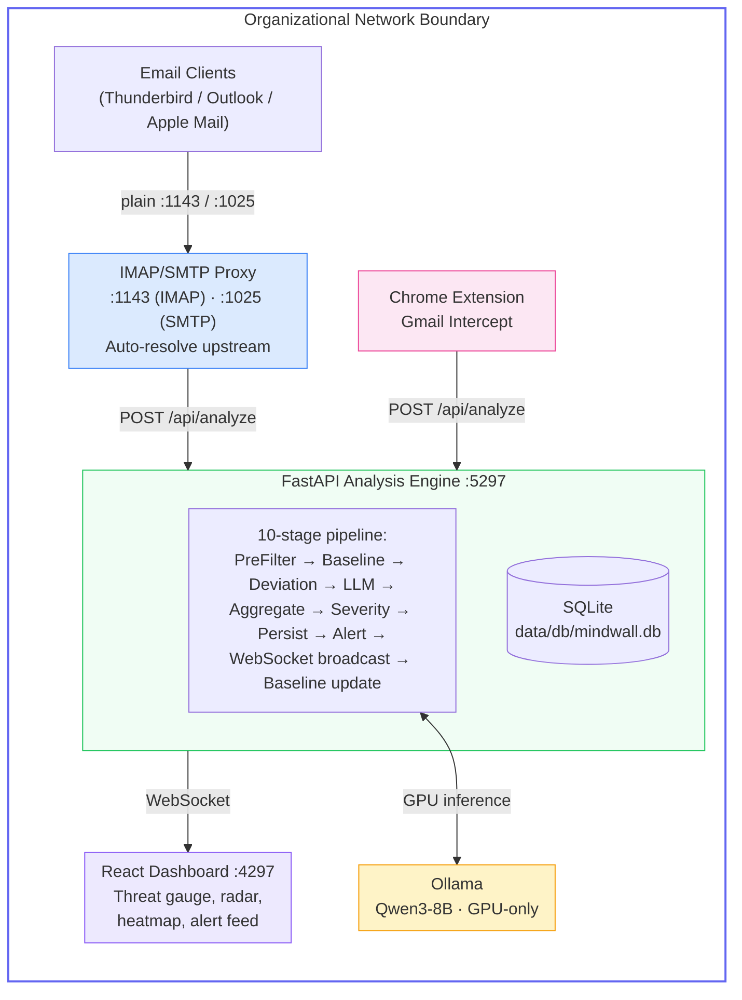

<p align="center">
  <h1 align="center">🛡️ MindWall</h1>
  <p align="center">
    <strong>Cognitive Firewall — AI-Powered Human Manipulation Detection</strong>
  </p>
  <p align="center">
    A fully self-hosted, privacy-first cybersecurity platform that intercepts, analyzes, and scores incoming communications for psychological manipulation tactics using a locally-run, fine-tuned large language model.
  </p>
  <p align="center">
    <a href="#quick-start">Quick Start</a> •
    <a href="#architecture">Architecture</a> •
    <a href="#features">Features</a> •
    <a href="#services">Services</a> •
    <a href="#email-client-setup">Email Setup</a> •
    <a href="#documentation">Docs</a> •
    <a href="#contributing">Contributing</a>
  </p>
  <p align="center">
    
    
    
    
    
  </p>
</p>

---

## Overview

MindWall acts as a transparent proxy between email clients and upstream mail servers, analyzing every incoming message through a 10-stage pipeline that combines rule-based pre-filtering, behavioral baseline analysis, and LLM-powered 12-dimension manipulation scoring — all running entirely on-premises. **Zero data leaves the deployment boundary.**

### Why MindWall?

Traditional email security focuses on malware and phishing links. MindWall detects **psychological manipulation** — artificial urgency, authority impersonation, fear/threat induction, emotional escalation, and 8 other cognitive attack dimensions that bypass conventional filters.

---

## Features

| Feature | Description |
|---------|-------------|
| **12-Dimension Analysis** | Artificial urgency, authority impersonation, fear/threat induction, reciprocity exploitation, scarcity tactics, social proof manipulation, sender behavioral deviation, cross-channel coordination, emotional escalation, request/context mismatch, unusual action requested, timing anomaly |
| **IMAP/SMTP Proxy** | Transparent interception — works with Thunderbird, Apple Mail, Outlook, any IMAP client |
| **Browser Extension** | Manifest V3 extension for Gmail web intercept via MutationObserver DOM injection |
| **Real-time Dashboard** | React 18 + Tailwind CSS with WebSocket-powered live threat feed, dimension radar, risk heatmap |
| **Behavioral Baselines** | Per-sender communication pattern learning with EMA deviation scoring |
| **Fine-tuned LLM** | Qwen3-4B fine-tuned with QLoRA via Unsloth, exported to GGUF for Ollama. Base runtime uses Qwen3-8B |
| **Privacy-First** | 100% on-premises — SQLite database, local Ollama server, no external API calls |
| **GPU Accelerated** | NVIDIA GPU passthrough via Docker with CUDA support |
| **Production-Ready** | Structured logging, health checks, request tracing, async throughout |

---

## Architecture



**Network isolation:** Ollama runs on a Docker-internal bridge network (`internal: true`) with no internet access. Only the API can reach it.

---

## Prerequisites

| Requirement | Minimum |
|-------------|---------|
| **Docker Desktop** | v24+ with Docker Compose v2 |
| **NVIDIA GPU** | 8GB VRAM (24GB recommended) |
| **NVIDIA Drivers** | 535+ with CUDA 12.x |
| **NVIDIA Container Toolkit** | Latest |
| **OS** | Linux (Ubuntu 22.04+), Windows 10/11 with WSL2, macOS (CPU-only) |
| **RAM** | 16GB minimum, 32GB recommended |
| **Disk** | 20GB free (model weights + database) |

---

## Quick Start

### Linux / macOS

```bash
git clone https://github.com/vrip7/mindwall.git
cd mindwall
chmod +x setup.sh
./setup.sh
```

### Windows (PowerShell)

```powershell
git clone https://github.com/vrip7/mindwall.git
cd mindwall
Set-ExecutionPolicy -Scope Process -ExecutionPolicy Bypass
.\setup.ps1
```

### Manual Setup

```bash
# 1. Copy environment config
cp .env.example .env

# 2. Generate API secret
openssl rand -hex 32   # paste into API_SECRET_KEY in .env

# 3. Create data directories
mkdir -p data/db data/models

# 4. Build and start
docker compose up -d --build

# 5. Pull the LLM model
docker compose exec ollama ollama pull qwen3:8b
```

### Verify Installation

```bash
# API health check
curl http://localhost:5297/health
# Expected: {"status":"ok"}

# Dashboard
open http://localhost:4297
# Login: admin / MindWall@2026

# Check Ollama model is loaded
docker compose exec ollama ollama list
```

---

## Services

| Service | Container | Port | Description |
|---------|-----------|------|-------------|
| **API Engine** | `mindwall-api` | `5297` | FastAPI — 10-stage analysis pipeline, REST API, WebSocket |
| **Dashboard** | `mindwall-ui` | `4297` | React 18 real-time threat monitoring UI |
| **Ollama** | `mindwall-ollama` | _internal only_ | LLM inference server (Qwen3-8B), not exposed to host |
| **IMAP Proxy** | `mindwall-proxy` | `1143` | Transparent IMAP proxy with email analysis + subject badge injection |
| **SMTP Proxy** | `mindwall-proxy` | `1025` | SMTP relay with upstream auto-resolve |

---

## Email Client Setup

MindWall's proxy auto-resolves the upstream mail server from the API when you log in. Configure your email client:

| Setting | Value |
|---------|-------|
| **IMAP Server** | `localhost` |
| **IMAP Port** | `1143` |
| **SMTP Server** | `localhost` |
| **SMTP Port** | `1025` |
| **Encryption** | **None** |
| **Username** | Your real email address |
| **Password** | Your real email password (app password for Gmail) |

> **Why "None" for encryption?** The connection from your client to the proxy is localhost-only. The proxy opens a TLS connection to the upstream server (e.g. `imap.gmail.com:993`).

**Before configuring your email client**, add the employee and their email account in the dashboard (Employees page) so the proxy knows which upstream server to connect to.

See [docs/email-client-setup.md](docs/email-client-setup.md) for step-by-step instructions for Thunderbird, Outlook, and Apple Mail.

---

## Scoring System

Emails are scored across **12 psychological manipulation dimensions** (0–100 each), combined into a weighted aggregate score:

| Score Range | Severity | Action | Alert Created |
|-------------|----------|--------|---------------|
| 0 – 34 | Low | Proceed | No |
| 35 – 59 | Medium | Verify | Yes |
| 60 – 79 | High | Verify | Yes |
| 80 – 100 | Critical | Block | Yes |

### The 12 Dimensions

| # | Dimension | Weight | Description |
|---|-----------|--------|-------------|
| 1 | **Authority Impersonation** | 0.15 | Falsely claiming or implying authority, rank, or official capacity |
| 2 | **Artificial Urgency** | 0.12 | Manufactured time pressure to rush decision-making |
| 3 | **Fear/Threat Induction** | 0.12 | Using threats, consequences, or fear to compel action |
| 4 | **Sender Behavioral Deviation** | 0.12 | Deviation from sender's typical communication patterns |
| 5 | **Cross-Channel Coordination** | 0.08 | Evidence of coordinated multi-channel social engineering |
| 6 | **Reciprocity Exploitation** | 0.07 | Leveraging past favors or obligations |
| 7 | **Scarcity Tactics** | 0.07 | Creating false scarcity of time, resource, or opportunity |
| 8 | **Emotional Escalation** | 0.07 | Escalating emotional intensity to override rational thinking |
| 9 | **Social Proof Manipulation** | 0.06 | Fabricating consensus or social validation |
| 10 | **Request/Context Mismatch** | 0.06 | Request inconsistent with stated context |
| 11 | **Unusual Action Requested** | 0.05 | Actions atypical for legitimate business communication |
| 12 | **Timing Anomaly** | 0.03 | Suspicious timing relative to sender's patterns |

---

## Browser Extension

The MindWall Chrome extension monitors Gmail's web interface in real time:

1. Open Chrome → `chrome://extensions/` → Enable Developer mode
2. Click **Load unpacked** → Select the `extension/` folder
3. Set the API key via `chrome.storage.local`
4. Open Gmail — emails are automatically analysed with badges injected

See [docs/browser-extension.md](docs/browser-extension.md) for detailed setup.

---

## Dashboard

Access the monitoring dashboard at `http://localhost:4297`:

- **Login**: `admin` / `MindWall@2026` (configurable via `.env`)
- **Overview**: Threat gauge, timeline chart, dimension radar, risk heatmap
- **Alerts**: Filterable alert feed with severity badges, dimension breakdowns, acknowledge actions
- **Employees**: Employee management, email account configuration, per-employee risk profiles
- **Settings**: Runtime-adjustable thresholds, weights, and LLM configuration

Real-time updates via WebSocket — new alerts appear instantly.

See [docs/dashboard.md](docs/dashboard.md) for full documentation.

---

## API Reference

**Base URL**: `http://localhost:5297`  
**Auth Header**: `X-MindWall-Key: your-api-secret-key`

| Method | Path | Description |
|--------|------|-------------|
| `POST` | `/api/analyze` | Submit email for manipulation analysis |
| `GET` | `/api/dashboard/summary` | Organisation-wide threat statistics |
| `GET` | `/api/dashboard/timeline` | Threat score timeline |
| `GET` | `/api/alerts` | Paginated alert list (filter by severity/status) |
| `GET` | `/api/alerts/{id}` | Full alert detail with dimension breakdown |
| `PATCH` | `/api/alerts/{id}/acknowledge` | Mark alert as reviewed |
| `GET` | `/api/employees` | Employee list with risk scores |
| `POST` | `/api/employees` | Create employee + configure email account |
| `DELETE` | `/api/employees/{id}` | Delete employee |
| `GET` | `/api/employees/{email}/risk-profile` | Per-employee risk profile |
| `GET` | `/api/settings` | Current system settings |
| `PUT` | `/api/settings` | Update thresholds/weights at runtime |
| `POST` | `/auth/login` | Dashboard login → returns API key |
| `WS` | `/ws/alerts` | Real-time alert stream |

See [docs/api-reference.md](docs/api-reference.md) for complete request/response documentation.

---

## Fine-Tuning

MindWall includes a complete QLoRA fine-tuning pipeline for training a specialised Qwen3-4B model:

```bash
cd finetune
pip install -r requirements.txt

python datasets/synthetic_generator.py    # Generate 20K synthetic emails
python prepare_dataset.py                 # Format into ChatML
python train.py                           # Train with QLoRA (8GB VRAM)
python evaluate.py                        # Evaluate on held-out test set
python export.py                          # Export to GGUF
```

**Key config** (`finetune/configs/qlora_config.yaml`):
- Base model: `unsloth/Qwen3-4B-Instruct-2507-bnb-4bit`
- LoRA: r=8, alpha=16, targets all attention + MLP layers
- Training: 3 epochs, batch=1 × 16 accumulation, lr=2e-4, cosine schedule
- Export: q4_k_m GGUF quantization for Ollama

See [docs/fine-tuning.md](docs/fine-tuning.md) for the full pipeline guide.

---

## Configuration

All configuration via environment variables in `.env`:

```dotenv
API_SECRET_KEY=<generated-secret>
DASHBOARD_USERNAME=admin
DASHBOARD_PASSWORD=MindWall@2026
OLLAMA_MODEL=qwen3:8b
```

Key settings adjustable at runtime (via dashboard or `PUT /api/settings`):
- Alert thresholds: medium=35, high=60, critical=80
- Pipeline weights: behavioral=0.6, LLM=0.4
- LLM timeout, pre-filter boost, log level

See [docs/configuration.md](docs/configuration.md) for all environment variables.

---

## Development

```bash
make dev          # Start with hot-reload (docker-compose.override.yml)
make prod         # Production deploy
make build        # Rebuild images
make down         # Stop all services
make logs         # Follow all logs
make logs-api     # Follow API logs only
make test         # Run API test suite
make lint         # Lint Python code (ruff)
make pull-model   # Pull Qwen3-8B into Ollama
make clean        # Full cleanup (containers, volumes, images)
make db-reset     # Reset database
```

See [docs/development.md](docs/development.md) for the full development guide.

---

## Documentation

Comprehensive documentation is available in the [`docs/`](docs/) folder:

| Document | Description |
|----------|-------------|
| [Getting Started](docs/getting-started.md) | Prerequisites, setup, verification |
| [Architecture](docs/architecture.md) | System design, data flow, database schema |
| [Configuration](docs/configuration.md) | All environment variables and tunable settings |
| [API Reference](docs/api-reference.md) | Complete HTTP + WebSocket endpoint docs |
| [Dashboard](docs/dashboard.md) | Monitoring UI guide |
| [Email Client Setup](docs/email-client-setup.md) | Thunderbird, Outlook, Apple Mail setup |
| [Browser Extension](docs/browser-extension.md) | Chrome extension installation and usage |
| [Proxy](docs/proxy.md) | IMAP/SMTP proxy internals |
| [Analysis Pipeline](docs/analysis-pipeline.md) | 10-stage pipeline deep dive |
| [Fine-Tuning](docs/fine-tuning.md) | QLoRA training pipeline |
| [Development](docs/development.md) | Local dev setup, contributing |
| [Security](docs/security.md) | Auth model, network isolation, data privacy |
| [Troubleshooting](docs/troubleshooting.md) | Common issues and solutions |

---

## Security

MindWall is designed for **internal network deployment only**. See [SECURITY.md](SECURITY.md) for responsible disclosure policy.

- **Authentication**: Shared `X-MindWall-Key` header with constant-time comparison
- **Network isolation**: Ollama on internal-only Docker network (no internet)
- **Privacy**: No email bodies persisted, no external API calls, structured logging with no PII

**Important:** Never expose MindWall ports (5297, 4297, 1143, 1025) to the public internet.

See [docs/security.md](docs/security.md) for full security documentation.

---

## Contributing

We welcome contributions! Please see [CONTRIBUTING.md](CONTRIBUTING.md) for guidelines on:

- Setting up a development environment
- Code style and standards
- Pull request process
- Issue reporting

---

## License

This project is licensed under the MIT License — see [LICENSE](LICENSE) for details.

---

## Credits

**Developed by [Pradyumn Tandon](https://pradyumntandon.com) at [VRIP7](https://vrip7.com)**

- Website: https://pradyumntandon.com
- Organization: https://vrip7.com
- GitHub: https://github.com/vrip7

---

<p align="center">
  <sub>MindWall — Because the most dangerous attacks target the mind, not the machine.</sub>
</p>
