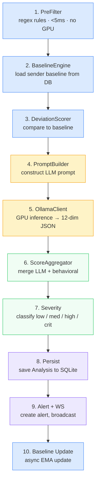

# Analysis Pipeline

> Deep dive into MindWall's 10-stage email analysis pipeline.

---

## Overview

Every email submitted to `POST /api/analyze` passes through a 10-stage pipeline that combines rule-based pre-filtering, per-sender behavioural baselines, LLM inference, and score aggregation.



---

## Stage 1: Pre-Filter

**File:** `api/analysis/prefilter.py`  
**Latency:** < 5ms  
**GPU:** None

The pre-filter applies regex and keyword pattern matching to detect common social engineering signals before invoking the LLM. This reduces unnecessary GPU load for clearly benign emails and provides a fast signal layer.

### Pattern Categories

| Category | Patterns | Boost |
|----------|----------|-------|
| **Urgency** | "immediately", "urgent", "ASAP", "act now", "expires today", "last chance" | +5.0 |
| **Authority** | "CEO", "CFO", "on behalf of", "compliance requirement", "FBI", "IRS" | +8.0 |
| **Fear/Threat** | "account suspended", "legal action", "prosecution", "security breach" | +7.0 |
| **Suspicious Request** | "wire transfer", "gift card", "click here", "verify your account", "do not share" | +5.0 per match (max +20.0) |
| **Emotional** | "please help", "desperately", "counting on you", "disappointed in you" | +4.0 |
| **Spoofed Sender** | `paypal.com-verify.xyz` patterns, generic `support@`/`admin@` addresses | +10.0 |
| **Timing** | Email sent before 5am or after 11pm | +3.0 |
| **All-Caps Subject** | Subject line is entirely uppercase (> 5 chars) | +3.0 |
| **Excessive Punctuation** | More than 3 exclamation marks | +2.0 |

### Output

```python
@dataclass
class PreFilterResult:
    triggered: bool         # Were any signals detected?
    signals: list[str]      # List of triggered signal names
    score_boost: float      # Total score boost to add
```

The `score_boost` is added to the final aggregate score after LLM scoring.

---

## Stage 2: Baseline Lookup

**File:** `api/analysis/behavioral/baseline.py`  
**Source:** `sender_baselines` table

Loads the sender's behavioural baseline for the given recipient. Each unique (sender, recipient) pair has its own baseline tracking:

| Metric | Description |
|--------|-------------|
| `avg_word_count` | EMA-smoothed average email length |
| `avg_sentence_length` | EMA-smoothed average sentence length |
| `typical_hours` | List of hours the sender typically sends (up to 8) |
| `formality_score` | 0 (informal) → 1 (formal) tone score |
| `sample_count` | How many emails have been processed |

Returns `None` if no baseline exists (first email from this sender).

---

## Stage 3: Deviation Scoring

**File:** `api/analysis/behavioral/deviation.py`  
**Minimum samples:** 3 (returns 0 if fewer)

Computes how much the current email deviates from the sender's baseline across four dimensions:

| Component | Weight | Calculation |
|-----------|--------|-------------|
| **Word count** | 0.30 | `abs(current - baseline) / baseline × 100`, capped at 100 |
| **Formality** | 0.30 | `abs(current - baseline) × 200`, capped at 100 |
| **Timing** | 0.25 | Distance from nearest typical hour, scaled: 6+ hours = 100 |
| **Sentence length** | 0.15 | `abs(current - baseline) / baseline × 100`, capped at 100 |

**Aggregate:**
$$\text{deviation} = 0.30 \times \text{wc} + 0.30 \times \text{form} + 0.25 \times \text{time} + 0.15 \times \text{sl}$$

Clamped to [0, 100].

### Formality Estimation

Quick formality assessment by counting formal vs informal markers:

- **Formal:** "dear", "sincerely", "regards", "hereby", "pursuant", "attached herewith"
- **Informal:** "hey", "yo", "gonna", "lol", "btw", "awesome", "cool"
- **Score:** `formal_count / (formal_count + informal_count)`, default 0.5 if no markers

---

## Stage 4: Prompt Construction

**File:** `api/analysis/prompt_builder.py`

Builds a structured prompt for the LLM containing:

1. **System prompt:** Defines MindWall's identity as a "clinical-grade cybersecurity inference engine" and forensic analyst. Lists all 12 dimensions with descriptions and scoring criteria.

2. **User prompt:** Contains:
   - Email body text
   - Sender email and display name
   - Subject line
   - Received hour (for timing analysis)
   - Sender baseline data (if available): average word count, typical hours, formality score, word count deviation percentage
   - Pre-filter signals already detected

3. **Expected output format:** JSON with:
   ```json
   {
     "dimension_scores": { "artificial_urgency": 0-100, ... },
     "explanation": "Natural language explanation",
     "recommended_action": "proceed|verify|block"
   }
   ```

---

## Stage 5: LLM Inference

**File:** `api/analysis/llm_client.py`

The `OllamaClient` sends the prompt to Ollama via HTTP:

- **Endpoint:** `POST {OLLAMA_BASE_URL}/api/generate`
- **Model:** Configured via `OLLAMA_MODEL` (default: `qwen3:8b`)
- **Temperature:** 0.1 (low for consistent, deterministic scoring)
- **Timeout:** Configurable (default 30s)
- **Format:** JSON mode enabled for structured output

### Fallback

If the LLM is unavailable or returns invalid JSON, the pipeline falls back to pre-filter-only scores (all 12 dimensions at 0, with only the pre-filter boost applied).

### Response Validation

The `_validate_llm_response()` method ensures:
- All 12 dimension keys exist (missing dimensions default to 0.0)
- All scores are valid floats, clamped to [0, 100]
- `explanation` field exists (defaults to "Analysis completed.")
- `recommended_action` is one of `proceed`, `verify`, `block` (defaults to `verify`)

---

## Stage 6: Score Aggregation

**File:** `api/analysis/scorer.py`

### Dimension Merging

For the `sender_behavioral_deviation` dimension specifically, the score is a **weighted blend** of the behavioural engine's deviation score and the LLM's assessment:

$$\text{blended} = 0.6 \times \text{behavioral\_deviation} + 0.4 \times \text{llm\_deviation}$$

All other 11 dimensions use the LLM's score directly.

### Aggregate Score

The final aggregate score is a **weighted sum** across all 12 dimensions:

$$\text{aggregate} = \sum_{d \in \text{dimensions}} \text{score}(d) \times \text{weight}(d)$$

**Dimension weights** (from `api/analysis/dimensions.py`):

| Dimension | Weight |
|-----------|--------|
| `authority_impersonation` | 0.15 |
| `artificial_urgency` | 0.12 |
| `fear_threat_induction` | 0.12 |
| `sender_behavioral_deviation` | 0.12 |
| `cross_channel_coordination` | 0.08 |
| `reciprocity_exploitation` | 0.07 |
| `scarcity_tactics` | 0.07 |
| `emotional_escalation` | 0.07 |
| `social_proof_manipulation` | 0.06 |
| `request_context_mismatch` | 0.06 |
| `unusual_action_requested` | 0.05 |
| `timing_anomaly` | 0.03 |
| **Total** | **1.00** |

### Pre-Filter Boost

After LLM + behavioural aggregation, the pre-filter's `score_boost` is added:

$$\text{final} = \min(100, \text{aggregate} + \text{prefilter\_boost})$$

---

## Stage 7: Severity Classification

| Score Range | Severity | Alert Created? |
|-------------|----------|----------------|
| 0 – 34.99 | `low` | No |
| 35 – 59.99 | `medium` | Yes |
| 60 – 79.99 | `high` | Yes |
| 80 – 100 | `critical` | Yes |

---

## Stage 8: Persistence

The analysis result is saved to the `analyses` table with a unique constraint on `(message_uid, recipient_email)` to prevent duplicate processing. Recorded fields include:

- All input metadata (sender, recipient, subject, channel, timestamps)
- Pre-filter results (triggered, signals)
- Aggregate score and individual dimension scores
- LLM explanation and recommended action
- Raw LLM response (for debugging)
- Processing time in milliseconds

---

## Stage 9: Alert + WebSocket Broadcast

If `aggregate_score ≥ 35`:

1. **Alert record** is created in the `alerts` table with a foreign key to the analysis
2. **WebSocket broadcast** sends a `new_alert` event to all connected dashboard clients:
   ```json
   {
     "event": "new_alert",
     "alert_id": 5,
     "analysis_id": 42,
     "recipient_email": "employee@company.com",
     "sender_email": "attacker@evil.com",
     "subject": "Urgent: Wire Transfer",
     "manipulation_score": 73.5,
     "severity": "high",
     "explanation": "...",
     "recommended_action": "verify",
     "dimension_scores": { ... }
   }
   ```

---

## Stage 10: Baseline Update

Runs **asynchronously** (fire-and-forget via `asyncio.create_task`) so it doesn't delay the response.

Updates the sender's behavioural baseline using **Exponential Moving Average** (EMA):

$$\text{new\_avg} = \alpha \times \text{current} + (1 - \alpha) \times \text{previous}$$

Where $\alpha = 0.15$ (the EMA smoothing factor).

Updated metrics:
- Average word count
- Average sentence length
- Typical send hours (up to 8 most recent unique hours)
- Formality score

If no baseline exists, one is created from the current email's metrics.

---

## The 12 Manipulation Dimensions

**File:** `api/analysis/dimensions.py`

| # | Dimension | Description |
|---|-----------|-------------|
| 1 | **Artificial Urgency** | Manufactured time pressure designed to rush decision-making |
| 2 | **Authority Impersonation** | Falsely claiming or implying authority, rank, or official capacity |
| 3 | **Fear/Threat Induction** | Using threats, consequences, or fear to compel action |
| 4 | **Reciprocity Exploitation** | Leveraging past favours or obligations to compel compliance |
| 5 | **Scarcity Tactics** | Creating false scarcity of time, resource, or opportunity |
| 6 | **Social Proof Manipulation** | Fabricating consensus, peer behaviour, or social validation |
| 7 | **Sender Behavioral Deviation** | Deviation from this sender's typical communication patterns |
| 8 | **Cross-Channel Coordination** | Evidence of coordinated multi-channel social engineering attack |
| 9 | **Emotional Escalation** | Escalating emotional intensity to override rational thinking |
| 10 | **Request/Context Mismatch** | Request is inconsistent with the stated context or relationship |
| 11 | **Unusual Action Requested** | Requesting actions atypical for legitimate business communication |
| 12 | **Timing Anomaly** | Suspicious timing relative to sender's typical patterns |

---

## Performance Characteristics

| Stage | Typical Latency | GPU Required |
|-------|----------------|-------------|
| Pre-filter | < 5ms | No |
| Baseline lookup | < 10ms | No |
| Deviation scoring | < 5ms | No |
| Prompt construction | < 5ms | No |
| LLM inference | 1–3 seconds | Yes (NVIDIA) |
| Score aggregation | < 1ms | No |
| Severity + persist | < 50ms | No |
| Alert + broadcast | < 20ms | No |
| Baseline update | < 50ms (async) | No |
| **Total** | **~1.5–3.5 seconds** | |

The LLM inference stage dominates total processing time. With `OLLAMA_NUM_PARALLEL=4`, up to 4 emails can be analysed concurrently.
