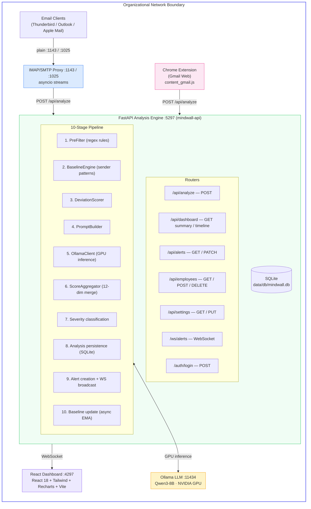

# Architecture

> System design, component interactions, and data flow in MindWall.

---

## Overview

MindWall is composed of **four Docker services** communicating over two internal networks:



---

## Docker Network Topology

| Network | Type | Members | Internet Access |
|---------|------|---------|-----------------|
| `mindwall-internal` | Bridge, `internal: true` | ollama, api | **No** — isolated from internet |
| `mindwall-host` | Bridge | api, proxy, dashboard | Yes — exposes ports to host |

Ollama is on the internal-only network, meaning the LLM server can never make outbound internet calls. The API service bridges both networks.

---

## Service Descriptions

### Ollama LLM Server (`mindwall-ollama`)

- **Image**: `ollama/ollama:latest`
- **Port**: 11434 (internal network only, not exposed to host)
- **GPU**: Requires 1x NVIDIA GPU with CUDA
- **Model**: Qwen3-8B (default) or fine-tuned MindWall-Qwen3-4B
- **Responsibility**: Inference-only. Receives structured JSON prompts from the API, returns 12-dimension manipulation scores.
- **Health check**: `ollama list` every 15 seconds.
- **Tuning**: `OLLAMA_NUM_PARALLEL=4` allows 4 concurrent inference requests. `OLLAMA_MAX_LOADED_MODELS=1` keeps memory usage predictable.

### FastAPI Analysis Engine (`mindwall-api`)

- **Build context**: `./api/`
- **Port**: 5297 (HTTP + WebSocket)
- **Language**: Python 3.12, FastAPI, async SQLAlchemy, HTTPX
- **Database**: SQLite with aiosqlite (file at `/srv/app/data/db/mindwall.db`)
- **Depends on**: Ollama (must be healthy before API starts)
- **Responsibility**: All business logic — analysis pipeline, employee management, alert management, dashboard aggregation, settings, WebSocket event broadcasting.
- **Entry**: `uvicorn app.main:app --host 0.0.0.0 --port 5297 --workers 4`
- **Health check**: `GET /health` every 15 seconds.

### IMAP/SMTP Proxy (`mindwall-proxy`)

- **Build context**: `./proxy/`
- **Ports**: 1143 (IMAP), 1025 (SMTP)
- **Language**: Python 3.12, asyncio, HTTPX, aiosmtpd
- **Depends on**: API (must be healthy)
- **Responsibility**: Intercepts email traffic between clients and upstream mail servers. For IMAP: intercepts FETCH responses containing email bodies, submits them to `/api/analyze`, and injects risk badges into subject lines. For SMTP: forwards outbound mail through the original upstream server while logging metadata.
- **Account resolution**: On LOGIN, the proxy queries `GET /api/email-accounts/lookup/{username}` to discover the upstream IMAP/SMTP server credentials.

### React Dashboard (`mindwall-ui`)

- **Build context**: `./dashboard/`
- **Port**: 4297
- **Stack**: React 18, Vite, Tailwind CSS, Recharts, Lucide icons, Axios
- **Depends on**: API
- **Responsibility**: Real-time monitoring UI with threat gauge, timeline charts, dimension radar, risk heatmap, alert feed with WebSocket live updates, employee management, and system configuration.

---

## Data Flow — Email Analysis

```
1. Email client (e.g. Thunderbird) is configured with:
   IMAP Server: localhost:1143, No encryption, real credentials

2. Client connects to MindWall IMAP proxy (port 1143)
   Proxy sends:  * OK [CAPABILITY IMAP4rev1] MindWall IMAP Proxy Ready

3. Client sends:  A001 LOGIN "user@company.com" "app-password"
   Proxy extracts username → queries MindWall API:
     GET /api/email-accounts/lookup/user@company.com
   Receives: {imap_host: "imap.gmail.com", imap_port: 993, ...}

4. Proxy opens TLS connection to upstream imap.gmail.com:993
   Forwards the LOGIN command → upstream authenticates

5. Client issues IMAP commands (SELECT, FETCH, etc.)
   Proxy pipes them transparently to upstream

6. When upstream returns a FETCH response with email body:
   a. FetchInterceptor detects BODY[]/RFC822 data
   b. Accumulates body bytes
   c. MIMEParser extracts text/HTML content
   d. HTMLSanitizer strips tags, normalises whitespace
   e. Submits to POST /api/analyze (async — doesn't block delivery)
   f. RiskScoreInjector prepends badge to Subject line if score ≥ 35:
      Subject: [🚨 MW:CRITICAL] Re: Wire Transfer Approval

7. Modified FETCH response is returned to the email client.

8. Inside the API, the 10-stage pipeline runs:
   Stage 1: PreFilter (regex patterns → signals + score boost)
   Stage 2: BaselineEngine (fetch sender's behavioral baseline)
   Stage 3: DeviationScorer (deviation from baseline patterns)
   Stage 4: PromptBuilder (construct structured LLM prompt)
   Stage 5: OllamaClient.generate() (GPU inference → 12-dim JSON)
   Stage 6: ScoreAggregator (merge LLM 40% + behavioral 60%)
   Stage 7: Severity classification (low/medium/high/critical)
   Stage 8: Persist Analysis record to SQLite
   Stage 9: If score ≥ 35 → create Alert + broadcast via WebSocket
   Stage 10: Async update SenderBaseline (exponential moving average)

9. Dashboard receives WebSocket `new_alert` event → updates live feed.
```

---

## Database Schema

MindWall uses five tables, all managed by SQLAlchemy ORM models in `api/db/models.py`:

### `employees`

| Column | Type | Notes |
|--------|------|-------|
| id | INTEGER PK | Auto-increment |
| email | TEXT UNIQUE | Employee email (lookup key) |
| display_name | TEXT | Full name |
| department | TEXT | Organisational unit |
| risk_score | REAL | 30-day rolling risk (0–100) |
| created_at | DATETIME | |
| updated_at | DATETIME | |

### `sender_baselines`

| Column | Type | Notes |
|--------|------|-------|
| id | INTEGER PK | |
| recipient_email | TEXT | Employee receiving the mail |
| sender_email | TEXT | External sender |
| avg_word_count | REAL | EMA-smoothed average |
| avg_sentence_length | REAL | EMA-smoothed average |
| typical_hours | TEXT (JSON) | List of common send-hour integers |
| formality_score | REAL | 0 (informal) → 1 (formal) |
| sample_count | INTEGER | How many emails in baseline |
| last_updated | DATETIME | |

**Unique constraint**: `(recipient_email, sender_email)`

### `analyses`

| Column | Type | Notes |
|--------|------|-------|
| id | INTEGER PK | |
| message_uid | TEXT | IMAP UID or extension-generated hash |
| recipient_email | TEXT | |
| sender_email | TEXT | |
| sender_display_name | TEXT | |
| subject | TEXT | |
| received_at | DATETIME | Original email timestamp |
| analyzed_at | DATETIME | When MindWall processed it |
| channel | TEXT | `imap` or `gmail_web` |
| prefilter_triggered | BOOLEAN | |
| prefilter_signals | TEXT (JSON) | List of triggered signal names |
| manipulation_score | REAL | Aggregate 0–100 |
| dimension_scores | TEXT (JSON) | Dict of 12 dimension scores |
| explanation | TEXT | LLM-generated natural language |
| recommended_action | TEXT | `proceed`, `verify`, or `block` |
| llm_raw_response | TEXT | Raw JSON from LLM |
| processing_time_ms | INTEGER | End-to-end latency |

**Unique constraint**: `(message_uid, recipient_email)` — prevents duplicate analysis.

### `alerts`

| Column | Type | Notes |
|--------|------|-------|
| id | INTEGER PK | |
| analysis_id | INTEGER FK → analyses.id | |
| severity | TEXT | `low`, `medium`, `high`, `critical` |
| acknowledged | BOOLEAN | Has a human reviewed this? |
| acknowledged_by | TEXT | Reviewer username |
| acknowledged_at | DATETIME | |
| created_at | DATETIME | |

### `email_accounts`

| Column | Type | Notes |
|--------|------|-------|
| id | INTEGER PK | |
| email | TEXT UNIQUE | Employee email |
| display_name | TEXT | |
| imap_host | TEXT | e.g. `imap.gmail.com` |
| imap_port | INTEGER | e.g. `993` |
| smtp_host | TEXT | e.g. `smtp.gmail.com` |
| smtp_port | INTEGER | e.g. `587` |
| username | TEXT | Login username |
| password | TEXT | App password |
| use_tls | BOOLEAN | |
| enabled | BOOLEAN | |
| created_at | DATETIME | |
| updated_at | DATETIME | |

---

## Project Structure

```
mindwall/
├── api/                           # FastAPI analysis engine
│   ├── analysis/                  # AI analysis pipeline
│   │   ├── pipeline.py            #   10-stage orchestrator
│   │   ├── prefilter.py           #   Regex-based pre-filter
│   │   ├── scorer.py              #   Score aggregation
│   │   ├── llm_client.py          #   Ollama HTTP client
│   │   ├── prompt_builder.py      #   LLM prompt construction
│   │   ├── dimensions.py          #   12-dimension definitions
│   │   └── behavioral/            #   Behavioral analysis
│   │       ├── baseline.py        #     Per-sender baseline engine
│   │       ├── cross_channel.py   #     Multi-channel detection
│   │       └── deviation.py       #     Deviation scoring
│   ├── core/                      # Infrastructure
│   │   ├── config.py              #   Pydantic settings
│   │   ├── lifespan.py            #   Startup / shutdown lifecycle
│   │   └── logging.py             #   Structured JSON logging
│   ├── db/                        # Database layer
│   │   ├── database.py            #   Engine, session factory, migrations
│   │   ├── models.py              #   SQLAlchemy ORM models
│   │   └── repositories/          #   Data access repositories
│   │       ├── analysis_repo.py   #     Analysis CRUD + aggregations
│   │       ├── alert_repo.py      #     Alert CRUD + filtering
│   │       ├── baseline_repo.py   #     Baseline upsert / lookup
│   │       └── employee_repo.py   #     Employee CRUD + risk scoring
│   ├── middleware/                 # HTTP middleware
│   │   ├── auth.py                #   X-MindWall-Key validation
│   │   └── request_id.py          #   X-Request-ID tracing
│   ├── routers/                   # API endpoints
│   │   ├── analyze.py             #   POST /api/analyze
│   │   ├── dashboard.py           #   GET /api/dashboard/*
│   │   ├── alerts.py              #   GET/PATCH /api/alerts/*
│   │   ├── employees.py           #   CRUD /api/employees/*
│   │   ├── settings.py            #   GET/PUT /api/settings
│   │   ├── email_accounts.py      #   CRUD /api/email-accounts/*
│   │   ├── auth.py                #   POST /auth/login
│   │   └── websocket.py           #   WS /ws/alerts
│   ├── schemas/                   # Pydantic request/response models
│   ├── websocket/                 # WebSocket management
│   │   ├── manager.py             #   Connection pool + broadcast
│   │   └── events.py              #   Event type definitions
│   ├── Dockerfile
│   ├── main.py                    # App factory (create_app)
│   └── requirements.txt
├── proxy/                         # IMAP/SMTP transparent proxy
│   ├── imap/                      # IMAP proxy
│   │   ├── server.py              #   IMAP server + client handler
│   │   ├── upstream.py            #   TLS connection to upstream IMAP
│   │   ├── interceptor.py         #   FETCH body interception
│   │   ├── parser.py              #   RFC 3501 command/response parser
│   │   └── injector.py            #   Risk badge Subject injection
│   ├── smtp/                      # SMTP proxy
│   │   ├── server.py              #   aiosmtpd handler + upstream resolve
│   │   └── upstream.py            #   smtplib send via upstream SMTP
│   ├── mime/                      # Email content extraction
│   │   ├── parser.py              #   MIME multipart parser
│   │   └── sanitizer.py           #   HTML → plain text sanitizer
│   ├── tls/                       # TLS utilities
│   │   └── handler.py             #   SSL context factory
│   ├── config.py                  # Proxy configuration
│   ├── main.py                    # Proxy entrypoint
│   ├── Dockerfile
│   └── requirements.txt
├── dashboard/                     # React frontend
│   ├── src/
│   │   ├── App.jsx                # Router + authentication wrapper
│   │   ├── api/client.js          # Axios HTTP client
│   │   ├── pages/                 # Page components
│   │   │   ├── Dashboard.jsx      #   Overview with charts
│   │   │   ├── Alerts.jsx         #   Alert feed + detail
│   │   │   ├── Employees.jsx      #   Employee management
│   │   │   └── Settings.jsx       #   System configuration
│   │   └── components/            # Shared UI components
│   ├── Dockerfile
│   ├── package.json
│   ├── vite.config.js
│   └── tailwind.config.js
├── extension/                     # Chrome/Firefox extension
│   ├── manifest.json              # Manifest V3
│   ├── background.js              # Service worker
│   ├── content_gmail.js           # Gmail content script
│   └── icons/
├── finetune/                      # QLoRA fine-tuning pipeline
│   ├── train.py                   # Training script
│   ├── prepare_dataset.py         # Dataset preparation
│   ├── evaluate.py                # Model evaluation
│   ├── export.py                  # GGUF export for Ollama
│   ├── configs/qlora_config.yaml  # Training hyperparameters
│   └── datasets/                  # Data sources
│       ├── synthetic_generator.py # Synthetic data generation
│       ├── download.sh            # Corpus download scripts
│       └── download.ps1
├── docker-compose.yml             # Production orchestration
├── docker-compose.override.yml    # Development overrides
├── Makefile                       # Task runner
├── setup.sh                       # Linux/macOS setup
├── setup.ps1                      # Windows setup
└── .env.example                   # Environment template
```
