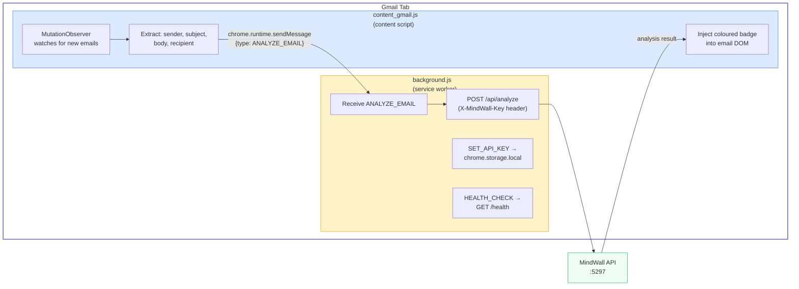

# Browser Extension

> MindWall Chrome/Firefox extension for real-time Gmail manipulation detection.

---

## Overview

The MindWall browser extension monitors Gmail's web interface and analyses emails in real time. When you open an email in Gmail, the extension:

1. Detects the newly rendered email DOM
2. Extracts sender, subject, recipient, and body text
3. Sends the content to the MindWall API for analysis
4. Injects a colour-coded risk badge directly into the Gmail UI

This works alongside (or instead of) the IMAP proxy, providing the `gmail_web` analysis channel.

---

## Architecture



---

## Installation

### Chrome (Developer Mode)

1. Open `chrome://extensions/`
2. Enable **Developer mode** (top right toggle)
3. Click **Load unpacked**
4. Select the `extension/` folder from the MindWall project
5. The MindWall extension should appear with a shield icon

### Firefox

1. Open `about:debugging#/runtime/this-firefox`
2. Click **Load Temporary Add-on**
3. Select `extension/manifest.json`

> **Note:** Firefox temporary extensions are removed on restart. For persistent installation, package as a `.xpi` file.

---

## Configuration

### Set the API Key

The extension needs the MindWall API key to authenticate requests. Set it via:

**Option 1 — Browser Console:**
```javascript
chrome.runtime.sendMessage(
  "YOUR_EXTENSION_ID",
  { type: "SET_API_KEY", key: "your-api-secret-key" }
);
```

**Option 2 — From the Gmail page console:**
```javascript
// The content script relays to the background worker
chrome.storage.local.set({ "CD080A0539991A69FC414E46CC3E7434": "your-api-secret-key" });
```

**Option 3 — Manually:**
1. Open the extension's background/service worker console
2. Run: `chrome.storage.local.set({"CD080A0539991A69FC414E46CC3E7434": "your-api-key"})`

### Verify Health

Open the browser console on any Gmail page and check:
```javascript
chrome.runtime.sendMessage("YOUR_EXTENSION_ID", { type: "HEALTH_CHECK" }, console.log);
```

Should return: `{ success: true }`

---

## How It Works

### Content Script (`content_gmail.js`)

The content script runs on `https://mail.google.com/*` and:

1. **Waits for Gmail to load** — polls for `div[role="main"]` every 500ms (30s timeout)
2. **Sets up MutationObserver** — watches for DOM changes in the main content area
3. **Scans for email containers** — looks for `.h7` (conversation view) or `.a3s.aiL` (email body) elements
4. **Extracts content:**
   - **Sender**: from `span[email]` or `.gD` elements
   - **Subject**: from `h2.hP` header
   - **Recipient**: from account switcher `aria-label` or `title`
   - **Body**: from `.a3s.aiL`, excluding `.gmail_quote` and `.gmail_signature`
5. **Generates a unique ID**: `gmail_web_<sha256(sender+subject)>` — prevents duplicate analysis
6. **Sends to background worker** via `chrome.runtime.sendMessage`
7. **Displays loading badge**: "🛡️ MindWall analyzing…"
8. **Injects result badge** with colour-coded severity

### Background Worker (`background.js`)

The service worker handles:

- **ANALYZE_EMAIL**: POSTs to `http://localhost:5297/api/analyze` with full email payload
- **SET_API_KEY**: Stores in `chrome.storage.local`
- **HEALTH_CHECK**: GETs `http://localhost:5297/health`

### Debouncing

Email scanning is debounced at **800ms** to prevent excessive API calls when Gmail renders multiple elements simultaneously.

---

## Badge Display

The extension injects badges directly into the Gmail DOM:

| Severity | Badge | Colour |
|----------|-------|--------|
| Critical (≥ 80) | `CRITICAL: 85` | Red background |
| High (≥ 60) | `HIGH: 72` | Orange background |
| Medium (≥ 35) | `MEDIUM: 45` | Yellow background |
| Low (< 35) | `LOW: 12` | Green background |

Badges appear as inline `<span>` elements with the class `mindwall-badge`, positioned near the email subject or body.

---

## Manifest V3

```json
{
  "manifest_version": 3,
  "name": "MindWall",
  "version": "1.0.0",
  "description": "Real-time manipulation detection for Gmail — Cognitive Firewall by VRIP7",
  "permissions": ["activeTab", "scripting", "storage"],
  "host_permissions": ["https://mail.google.com/*"],
  "content_scripts": [
    {
      "matches": ["https://mail.google.com/*"],
      "js": ["content_gmail.js"],
      "run_at": "document_idle"
    }
  ],
  "background": {
    "service_worker": "background.js"
  }
}
```

### Permissions

| Permission | Reason |
|-----------|--------|
| `activeTab` | Access to the currently active Gmail tab |
| `scripting` | Inject content scripts dynamically |
| `storage` | Store the API key in `chrome.storage.local` |
| `host_permissions: mail.google.com` | Run content script on Gmail |

---

## Icons

The extension requires three icon sizes in the `extension/icons/` folder:

| File | Size | Usage |
|------|------|-------|
| `icon16.png` | 16×16 | Toolbar icon |
| `icon48.png` | 48×48 | Extensions page |
| `icon128.png` | 128×128 | Chrome Web Store / install dialog |

Generate icons as PNG files with a transparent background. The design should represent a shield or cognitive firewall concept.

---

## Limitations

- **Gmail only**: The content script is specifically designed for Gmail's DOM structure. Other webmail providers would need separate content scripts.
- **DOM dependency**: Gmail's internal class names (`.h7`, `.a3s.aiL`, `.gD`, `.hP`) may change with Gmail updates. The extension would need updating if Google changes these.
- **localhost only**: The extension connects to `http://localhost:5297`. For remote MindWall deployments, edit `API_BASE` in `background.js`.
- **Single account**: The recipient email extraction assumes a single Gmail account. Multi-account setups may extract the wrong recipient.
