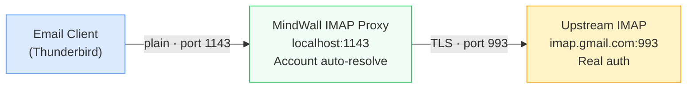
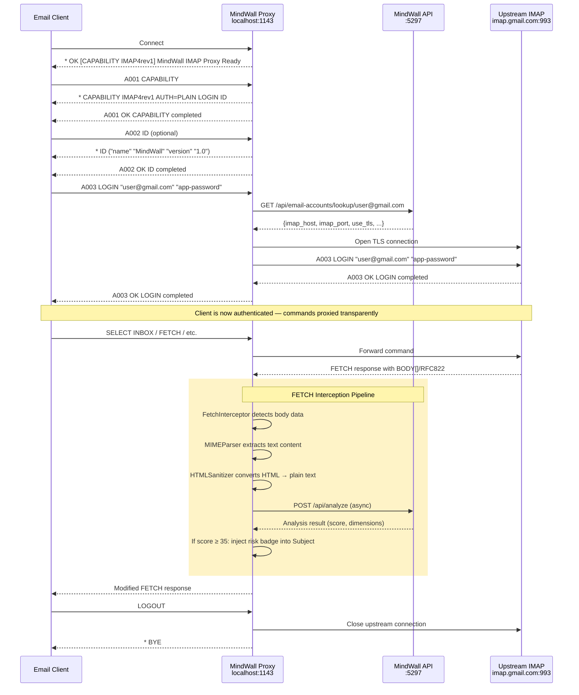
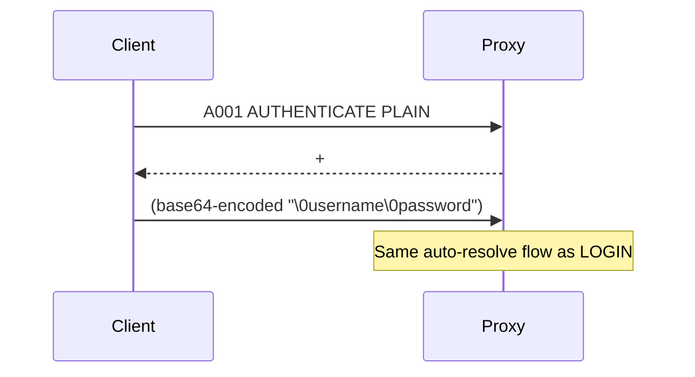
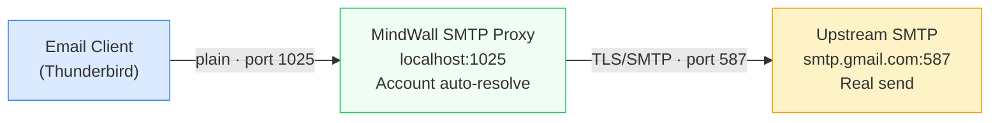

# IMAP/SMTP Proxy

> Transparent email proxy that intercepts, analyses, and annotates email traffic.

---

## Overview

The MindWall proxy is a Python asyncio service that sits between email clients and upstream mail servers. It provides two protocols:

| Protocol | Port | Purpose |
|----------|------|---------|
| IMAP | 1143 | Intercepts incoming email, runs analysis, injects risk badges |
| SMTP | 1025 | Monitors outbound email, forwards through upstream server |

---

## IMAP Proxy

### Connection Flow



### Detailed Protocol Flow



### AUTHENTICATE PLAIN Support

Besides LOGIN, the proxy supports SASL AUTHENTICATE PLAIN (used by some clients):



### Supported IMAP Commands (Pre-Auth)

| Command | Handler | Description |
|---------|---------|-------------|
| `CAPABILITY` | Local | Returns `IMAP4rev1 AUTH=PLAIN LOGIN ID` |
| `LOGIN` | Proxy + upstream | Resolves upstream, authenticates |
| `AUTHENTICATE PLAIN` | Proxy + upstream | SASL PLAIN authentication |
| `ID` | Local | Returns MindWall server identity (RFC 2971) |
| `NOOP` | Local | No-op keep-alive |
| `STARTTLS` | Rejected | Returns `NO` — proxy uses plaintext locally |
| `LOGOUT` | Local | Closes connection |

After authentication, **all commands** are forwarded transparently to the upstream server.

---

## SMTP Proxy

### Connection Flow



### How It Works

1. Email client connects to `localhost:1025` via SMTP
2. Client authenticates with `AUTH LOGIN` or `AUTH PLAIN` — proxy stores the username
3. Client sends `MAIL FROM`, `RCPT TO`, `DATA` with the email body
4. Proxy's `handle_DATA` method:
   - Extracts the sender username from the authentication session
   - Queries `GET /api/email-accounts/lookup/{username}` to find the upstream SMTP server
   - Connects to the upstream SMTP server (e.g. `smtp.gmail.com:587`)
   - Starts TLS and authenticates with the real credentials
   - Forwards the email through the upstream server
5. Returns success/failure status to the email client

### SMTP Authentication

The proxy uses `aiosmtpd` with a custom authenticator that accepts any credentials (since actual authentication happens with the upstream server). The authenticator stores the login username for later upstream resolution.

---

## Auto-Resolve Mechanism

Both IMAP and SMTP proxies use the same auto-resolve flow:

1. Client provides credentials (username = email address)
2. Proxy calls `GET /api/email-accounts/lookup/{username}`
3. API returns the full account configuration:
   ```json
   {
     "imap_host": "imap.gmail.com",
     "imap_port": 993,
     "smtp_host": "smtp.gmail.com",
     "smtp_port": 587,
     "username": "user@gmail.com",
     "password": "app-password",
     "use_tls": true
   }
   ```
4. Proxy connects to the upstream server using these settings

This means the proxy doesn't need any hardcoded server configuration — it discovers everything from the MindWall database at authentication time.

---

## FETCH Interception

The `FetchInterceptor` class monitors upstream IMAP responses for email body data:

### Detection

```python
# Detects FETCH responses containing body data:
# * 1 FETCH (UID 12345 BODY[] {4096}
# The {4096} indicates 4096 bytes of literal data follow
```

### Processing Pipeline

1. **IMAPParser.is_fetch_response()** — Identifies FETCH response lines
2. **IMAPParser.has_body_data()** — Extracts byte count from literal marker
3. **Accumulate body bytes** — Reads until byte count satisfied
4. **MIMEParser.parse()** — Extracts `text/plain` and `text/html` from MIME structure
5. **HTMLSanitizer.sanitize()** — Strips HTML tags, scripts, styles → clean text
6. **POST /api/analyze** — Submits for analysis (async, non-blocking to email delivery)
7. **RiskScoreInjector.inject_score()** — Modifies Subject header if score ≥ 35

### Subject Line Injection

For high-risk emails, the injector prepends a badge to the Subject line:

```
Before: Subject: Re: Wire Transfer Approval
After:  Subject: [🚨 MW:CRITICAL] Re: Wire Transfer Approval
```

Additionally, custom headers are added:
```
X-MindWall-Score: 85.3
X-MindWall-Severity: critical
```

---

## MIME Parsing

The `MIMEParser` handles RFC 2822 email structure:

- Processes `multipart/mixed`, `multipart/alternative`, `multipart/related`
- Extracts `text/plain` and `text/html` content parts
- Skips binary attachments
- Falls back to treating raw content as plain text on parse errors

The `HTMLSanitizer` converts HTML to clean text:
- Removes `<script>` and `<style>` blocks entirely
- Converts block elements (`<p>`, `<div>`, `<br>`, headings) to newlines
- Strips all remaining HTML tags
- Decodes HTML entities (`&amp;` → `&`)
- Normalises whitespace

---

## Configuration

All proxy settings are in environment variables (see [Configuration](configuration.md)):

```yaml
# docker-compose.yml
proxy:
  environment:
    - API_BASE_URL=http://api:5297
    - API_SECRET_KEY=${API_SECRET_KEY}
    - IMAP_LISTEN_HOST=0.0.0.0
    - IMAP_LISTEN_PORT=1143
    - SMTP_LISTEN_HOST=0.0.0.0
    - SMTP_LISTEN_PORT=1025
```

---

## File Structure

```
proxy/
├── main.py              # Entrypoint — starts both IMAP and SMTP servers
├── config.py            # ProxyConfig dataclass from env vars
├── Dockerfile
├── requirements.txt
├── imap/
│   ├── server.py        # IMAP server + client handler
│   ├── upstream.py      # TLS connection to upstream IMAP
│   ├── interceptor.py   # FETCH body interception + API submission
│   ├── parser.py        # RFC 3501 command/response parser
│   └── injector.py      # Risk badge Subject injection
├── smtp/
│   ├── server.py        # aiosmtpd handler + upstream resolve
│   └── upstream.py      # smtplib send via upstream SMTP
├── mime/
│   ├── parser.py        # MIME multipart parser
│   └── sanitizer.py     # HTML → plain text sanitizer
└── ssl/
    └── handler.py       # SSL context factory
```
